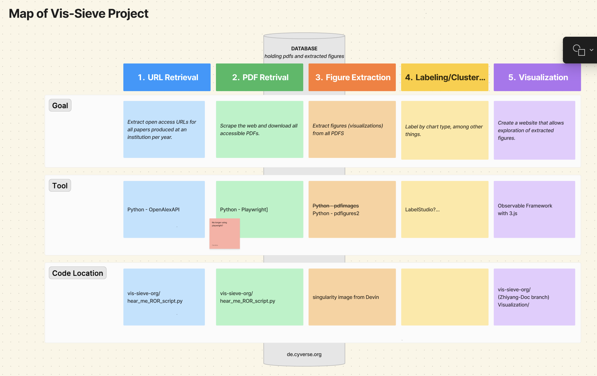

# 'Current' Code for Carolina

This folder contains scripts, data, code, that Carolina is currently digging into/understanding/modifying.
## Helpful Links

* [Figma - project map](https://www.figma.com/board/mlFcDDqibMWoxwXmNUnLUb/project-map?node-id=0-1&t=TMlNJ20Bfj19TBCP-0)


## Project Stages

1. get urls
2. get pdfs
3. get figs
4. label figs
5. visualization

!!! Needs to be updated
 "Goals, Tools, and Code Location associated with each project stage.")

## Description of Project Stages

* [1. get-urls] grabs links from all papers produced at an institution for a set of years (from OpenAlex)
* [2. get-pdfs] download the pdfs from those links, using Python's playwright library
* [3. get figs]
* [4. label figs]
* [5. visualization]
* [database] adds information on the institution, authors, papers, etc. to a DuckDB file (Python's duckdb library)

## Creating a conda environment with all of the needed packages

```
# packages needed for 01_get-urls
conda create --name vis-sieve requests tqdm
conda activate vis-sieve
pip install duckdb --upgrade
# packages needed for 02_get-pdfs
conda config --add channels conda-forge
conda config --add channels microsoft
conda install playwright
```


